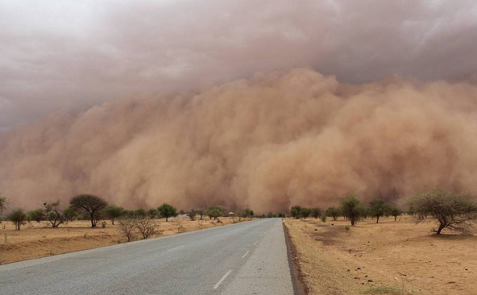

# #DataStory Sahel Initiative 2017

### C'est quoi ?
Une Exploration #DataDriven du Sahel

### C'est qui ? 
Corporate Hackers @AFD Group (CHAG)

### C'est quand ? 
20 Fev - 24 Mars // **C'est court !**

### C'est comment ? 
**C'est collaboratif**
- 3 demi-journées en mode #Makestorming
- Homework

## I. Source de données explorées ?
**Generaliste**
- data.afd.fr : http://data.afd.fr
- Humanitarian Data Exchange:https://data.humdata.org/ 

**Géographique**
- map: http://www.openstreetmap.org/
- Données OSM téléchargeables sur http://download.geofabrik.de/africa.html 
Pour les aires administratives, plusieurs possibilités (codées de manière séquentielle Admin0 = frontière pays, Admin1 = régions, Admin2 = départements/districts, etc. les niveaux pouvant changer d’un pays à l’autre.):
- Admin1 assez mise à jour et “dentelle grossière” donc fichiers plus légers: http://www.naturalearthdata.com/downloads/10m-cultural-vectors/ 
- Admin jusqu’au niveau 3 ou 4 : http://www.gadm.org/version2 
=> fonds de carte en shp téléchargés et disponibles sur : I:\ERS\Capitalisation\Outils\Data

**Infrastructures:** 
- Données d’infrastructures en Afrique : www.infrastructureafrica.org, plans des réseaux routiers, électriques, centrales, etc

** Population: **
- http://www.worldpop.org.uk : Estimation très fine à partir de données de census et satellitaires 
- world gridded population data : http://sedac.ciesin.columbia.edu/data/collection/gpw-v4 . Modélisation s’appuyant partent principalement des données de recensement disponibles et font des projection pour avoir les population par pixel pour des périodes de 5 an.

**Occupation des sols:** https://modis.gsfc.nasa.gov/data/dataprod/mod12.php

**Données socio-culturelles/gouvernance:**
- http://www.afrobarometer.org/fr/pays/: Perception des conditions de vie, gouvernance, culture société
- http://www.icr.ethz.ch/data/geoepr: Geo-referencing Ethnic Power Relations: relations politiques entre ethnies.

** Gouvernance, paix, sécurité (données très riches) **
Parmi les 11 pays africains à l’avoir déjà fait, seul le Mali (enquêtes en 2013 et 2015) est dans notre présente zone d’intérêt. Tchad, Niger et Sénégal sont dans le pipeline. 
- Rapport Mali : http://www.instat-mali.org/contenu/eq/dynapaix14-15_eq.pdf 
- http://www.acleddata.com/. Conflits (troubles, manifestations, violences) : Deux bases disponibles : 1997-2016 et 2017 (actualisée en continu). Consultable via API

**Sécurité Alimentaire:** 
- Données fewsnet: agrègent veille sur la sécurité alimentaire en Afrique, http://api.tiles.mapbox.com/v3/gfdrr-labs.map-44bl16ot,fews-net.sahel-fewsnet-foodsecurity-apriljune-2012/mm/zoompan,tooltips,legend,bwdetect.html#5/20.006412000431233/0.14257812500001207

On trouve une quantité impressionnante de données pour la zone sahélienne sur HDX sur ce sujet, en particulier deux enquêtes menées plusieurs fois par an dans chaque pays : 
- IPC (Integrated Phase Classification, soutenues par l’UE, UKAid et USAID et mises en oeuvre par des ) 
- SMART (Standardized Monitoring and Assessment of Relief and Transitions, soutenues par le PAM, OMS et UNICEF) mis en oeuvre par les INS auprès de 2000 ménages
- Enquête vulnérabilité, nutrition, insécurité alimentaire (soutenues par UNICEF, BM, Luxdev, Gates, PAM), identifiables sur http://www.ihsn.org/home/

**Socioéconomique**
MICS : http://mics.unicef.org/surveys (social, démographique, santé)
EDS : http://dhsprogram.com/data/available-datasets.cfm (social, démographique santé)
Sociales et économiques : http://catalog.ihsn.org (sociales, économiques, entreprises)
Microdonnées Banque mondiale : http://microdata.worldbank.org/ (divers, entreprises, services financiers)
Enquêtes LSMS : http://go.worldbank.org/XP4GRPITV0 (sociales, économiques, NB : nouvelle vague d’enquêtes au Mali, Niger et Burkina aisément accessibles avec notamment des données très riches sur l’agriculture)

**Open data nationaux - via ADB**
Mauritanie: http://mauritania.opendataforafrica.org/data#menu=topic
Mali: http://mali.opendataforafrica.org/ 
Niger http://niger.opendataforafrica.org/ 
Burkina: http://burkinafaso.opendataforafrica.org/
Tchad: http://chad.opendataforafrica.org/ 

## II. Dimensions

**Données infranationales (par région dans un premier temps)**

**Données macro : la plupart sont disponibles sur http://data.afd.fr **
- Nombre d’habitants (distribution de la population)
- Taux de croissance de la population
- Densité (nombre de personne / km)
- PIB / tête
- Pauvreté monétaire
- Données développement humain
- Taux de malnutrition chronique 
- Taux de mortalité maternelle et infantile
- Taux de prévalence contraceptive
- Taux net de scolarisation (répartition par sexe)
- Taux d’achèvement du primaire (répartition par sexe)
- Proportion d’adolescents (12-17 ans) hors du système scolaire (répartition par sexe)  
- Taux de couverture des services sociaux (Nombre d’écoles / centres de formation professionnelle par habitant - Nombre de médecins / sage-femmes par habitant - Taux d’accouchement assistés) 
- Pourcentage des ménages ayant accès à une infrastructure de santé, d’éducation, et d’adduction d’eau potable / distance moyenne à ces infrastructures
- Taux d’accès à l’électricité
- Nombre et fréquence des marchés commerciaux 
- Taux de chômage (par tranche d’âge) /taux de sous-emploi? 
A trouver:
- Indicateur sur insertion sociale des jeunes? 
- Protection sociale? 
- Taux de bancarisation formelle/informelle?

**Gouvernance:**
- Niveau de fonctionnalité des collectivités locales ;
- Nombre d’actes de délibération des conseils des collectivités adoptés, 
- Nombres d’ouvrages socio-économiques réalisés sous maîtrise d’ouvrage des collectivités territoriales
- Indicateur justice? confiance dans les institutions / perception de la corruption

**Flux migratoires**
- Mouvements de déplacements: flux migratoires, focus sur les populations déplacées et retournées. 

**Sécurité (conflits, attaques, nombre d’actes de banditisme constatés…)**
- Voir section institutions dans http://data.afd.fr
- Financement par secteur
- Part des financements publics 
- Financement des autres bailleurs => Voir données IATI
